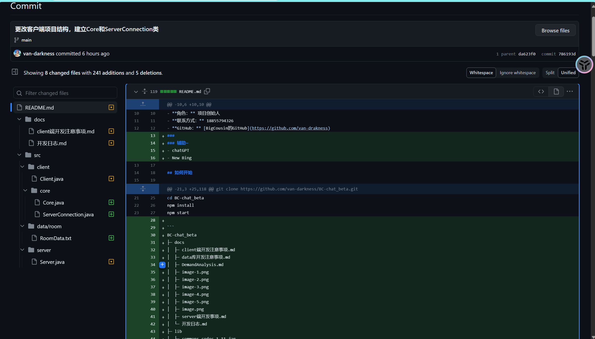

# 大表哥未来科技有限公司开发日志
## 项目github地址：
https://github.com/van-darkness/BC-chat_beta
## 需求分析
参考**DemandAnalysis.md**文档
### beta版本目标
- 用户功能
  - 实现客户端登陆内置账号密码功能
  - 实现单个房间的聊天功能
  - 基本的GUI界面
  - 可发送字符串消息
  - 发送消息显示昵称
- 服务器性能
  - 单个服务端接入入口
  - 局域网网络连接
  - 同时运行单个房间
## 技术选型
### 服务器内核
- java
### 客户端内核
- java
### 客户端UI界面
- java
### 版本控制
- git
### 代码托管
- github
## 项目commit查看示例

## 开发日志(截图)

## 开发难题
### 利用git和github进行版本控制
- [x] **无法进行克隆和同步的问题**

### 用户状态分析
## 开发记录
- **合作新方案:使用github的codespace功能以及live share插件进行实时合作开发**
- **2023-11-29 修改项目结构：删去data端，分别在client和server中添加data库**
