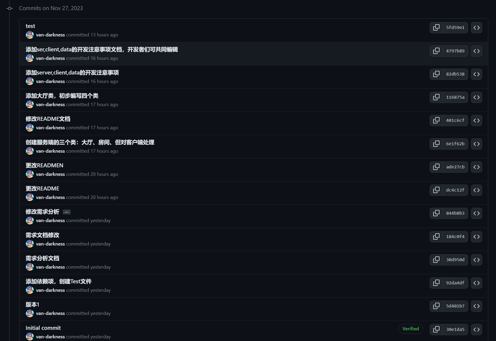
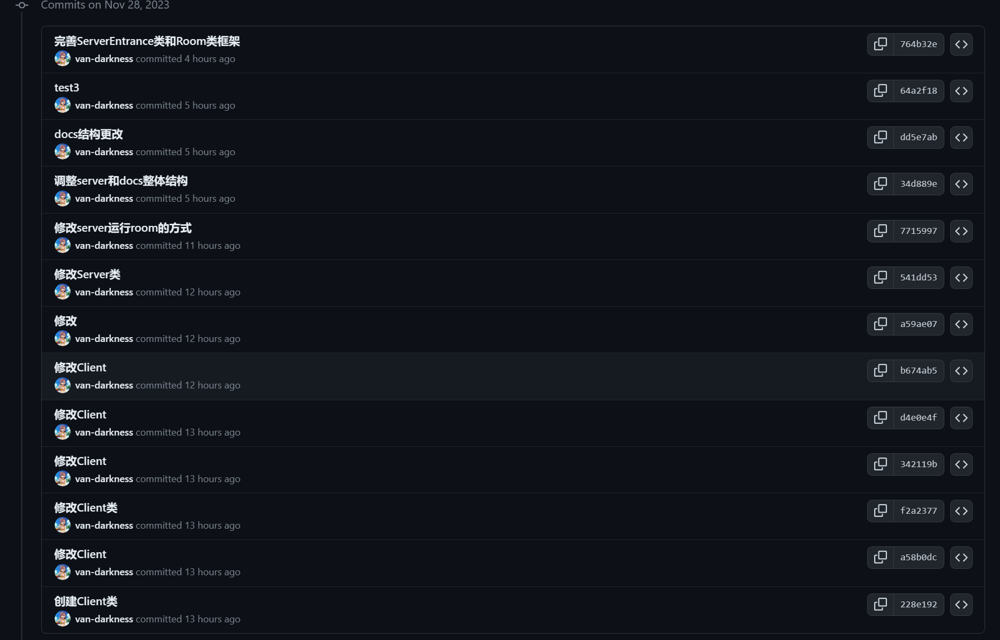
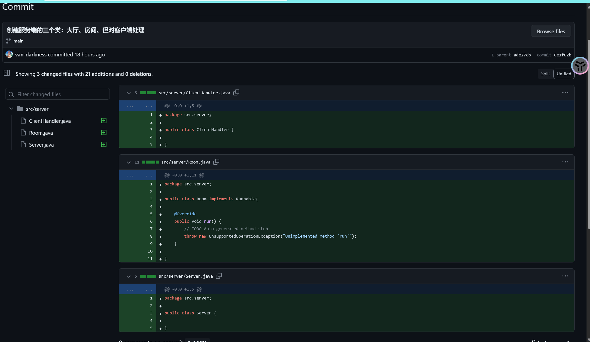
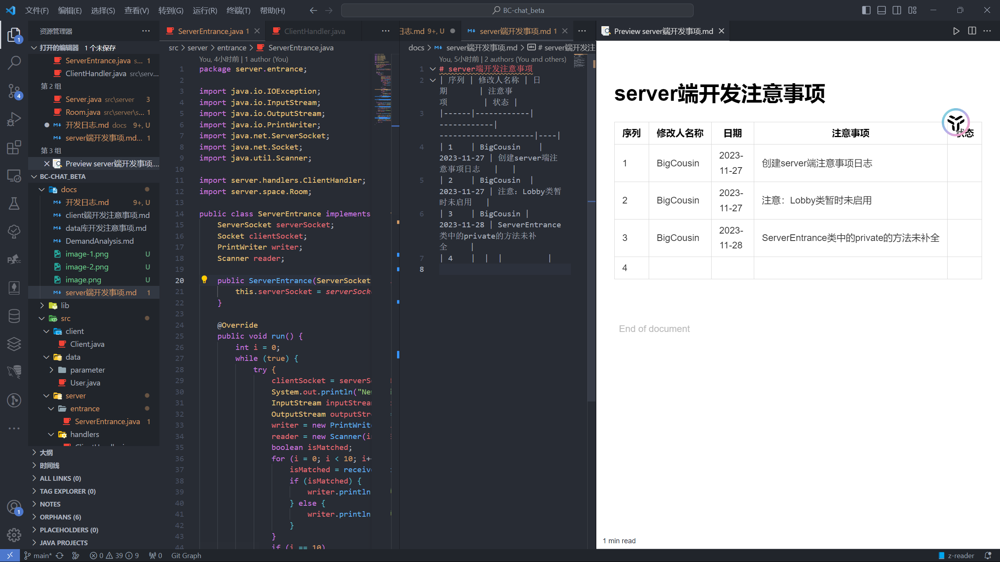
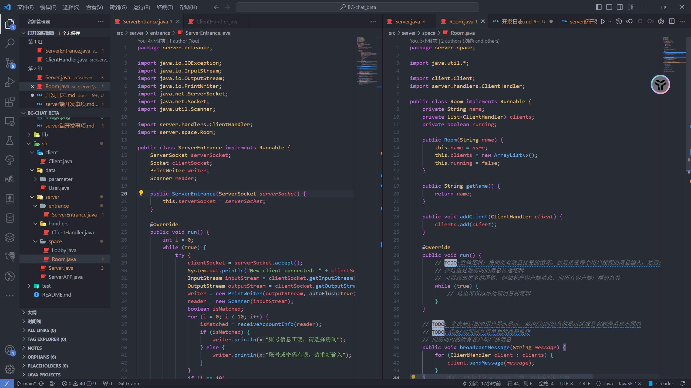
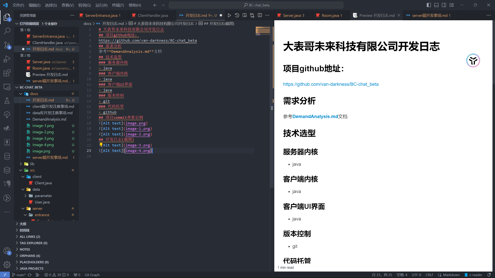

# 大表哥未来科技有限公司开发日志
## 项目github地址：
https://github.com/van-darkness/BC-chat_beta
## 需求分析
参考**DemandAnalysis.md**文档
## 技术选型
### 服务器内核
- java
### 客户端内核
- java
### 客户端UI界面
- java
### 版本控制
- git
### 代码托管
- github
## 项目commit查看示例

## 开发日志(截图)

## 开发难题
### 利用git和github进行版本控制
- [ ] 无法进行克隆和同步的问题
- **新方案:使用github的codespace功能以及live share插件进行实时合作开发**